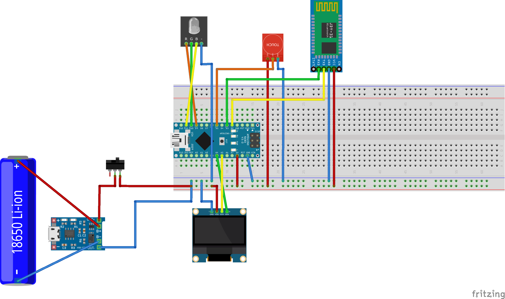

# E-va  
**Arduino Electronic Postcard**

## Overview  
e-va is an Arduino-based electronic postcard designed for interactive and creative communication.

---

## Resources  

### Website  
Visit the official website for more details:  
[http://eva-card.ru](http://eva-card.ru)

### Repository for the Website  
Access the source code and resources for the website:  
[GitHub Repository](https://github.com/GreyStekl0/eValentine)

### Figma Design  
Explore the design of the project on Figma:  
[Figma Link](https://www.figma.com/design/gMjSNmiAjOc4NHwnw9FoaY/%D0%AD%D0%BB%D0%B5%D0%BA%D1%82%D1%80%D0%BE%D0%BD%D0%BD%D0%B0%D1%8F-%D0%BE%D1%82%D0%BA%D1%80%D1%8B%D1%82%D0%BA%D0%B0-%22E-va%22?node-id=0-1&t=fRRynMtTbi38coy6-1)

### Prototype Diagram  
View the schematic of the e-va2 prototype:  

---

## Features  
- Arduino-powered interactive postcard.  
- Unique and creative gift solution.  
- Easily customizable for various themes and occasions.  

---

## Getting Started  
1. Clone the repository for the website or access design resources.  
2. Refer to the schematic (`e-va2_МП.png`) for building your prototype.  
3. Customize and deploy the e-va card according to your requirements.

For further details or support, please reach out via the website or repository issues section.
